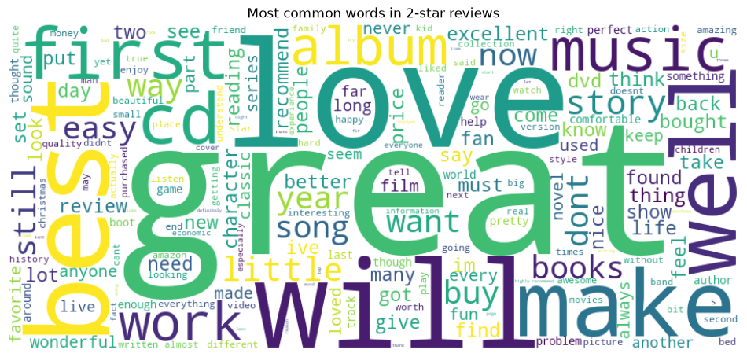
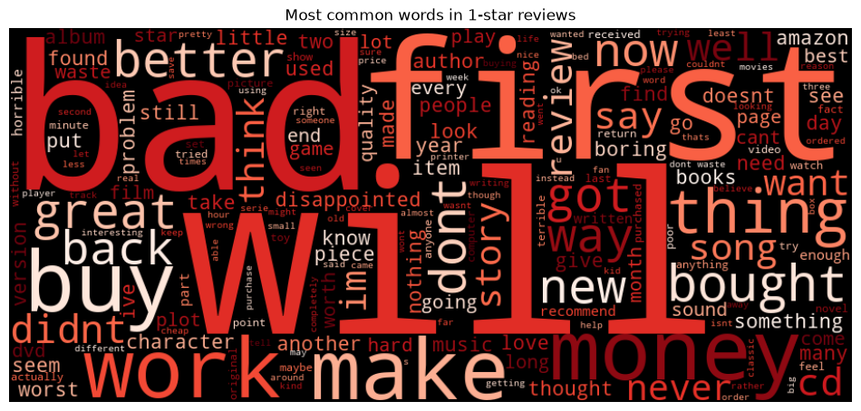
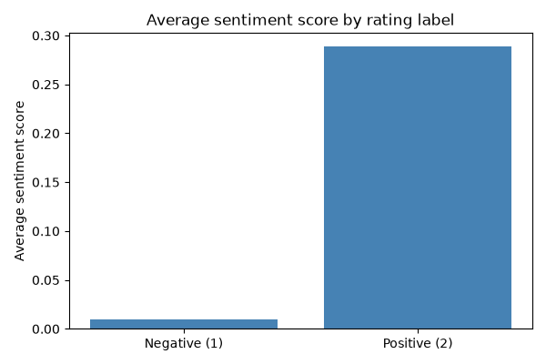
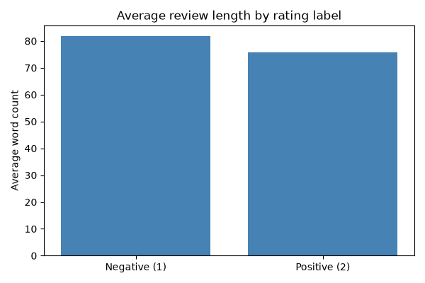

# Amazon Review Sentiment Analysis - Python & Power BI

A small NLP + BI portfolio project. A Python script turns raw Amazon
product reviews into an enriched, feature-engineered dataset (sentiment
score, review length, punctuation use), which a Power BI dashboard then
uses to compare star ratings against actual review sentiment.

## Data

Source: [Kaggle - Amazon Reviews](https://www.kaggle.com/datasets/bittlingmayer/amazonreviews),
a public dataset of Amazon product reviews labeled `__label__1` (negative)
or `__label__2` (positive). It contains review text and ratings only - no
customer names, emails or other personal data.

The raw file (`train.ft.txt.bz2`, ~500 MB) is not included in this repo.
Download it from Kaggle and place it next to `main.py` before running the
script - it reads the first 5000 labeled reviews by default.

`opinie_klientow.csv` is committed as a ready-to-use sample so the Power BI
dashboard opens with data out of the box. If you re-run `main.py`, it will
be overwritten with a freshly processed batch.

## Pipeline (`main.py`)

1. `load_data` - reads labeled reviews from the bz2 file into a DataFrame
2. `process_data` - feature engineering: `word_count`, `char_count`,
   `exclamation_count`, and `sentiment_score` (TextBlob polarity, -1 to 1,
   computed on the raw text before cleaning)
3. `generate_wordclouds` - builds word clouds for the best- and
   worst-rated reviews
4. `export_data` - writes the enriched dataset to CSV for Power BI

## Business questions the dashboard answers

- Does the star rating agree with the actual sentiment of the review text?
- Do negative reviews tend to be longer than positive ones?
- Do angry customers use more exclamation marks?
- Which words dominate positive vs. negative reviews?

## Example output

No Power BI Desktop needed to see what this project produces:

| | |
|---|---|
|  |  |
| Most common words in positive reviews | Most common words in negative reviews |
|  |  |
| Average sentiment is only slightly positive for negative-labeled reviews and clearly positive for positive-labeled ones - TextBlob doesn't fully separate the two | Negative reviews run a bit longer on average than positive ones |

Generate these yourself with `python main.py` (word clouds) and
`python generate_charts.py` (the two bar charts, built directly from
`opinie_klientow.csv`).

## Tech stack

- **Python** - pandas, TextBlob (sentiment), WordCloud, matplotlib, tqdm
- **Power BI** - interactive dashboard

## Repository structure

```
main.py                 data loading, feature engineering, sentiment analysis, word clouds
generate_charts.py      sentiment/word-count bar charts, built from opinie_klientow.csv
docs/
  images/                 word clouds and charts embedded above
opinie_klientow.csv     sample enriched dataset (see Data)
*.pbix                  Power BI dashboard
requirements.txt
```

## Quick start

```bash
python3 -m venv .venv
source .venv/bin/activate        # Windows: .venv\Scripts\activate
pip install -r requirements.txt

# download train.ft.txt.bz2 from the Kaggle link above and place it here
python main.py

# optional: bar charts built from opinie_klientow.csv
python generate_charts.py

# open the .pbix file in Power BI Desktop
# to use freshly generated data, refresh the source pointing at opinie_klientow.csv
```
